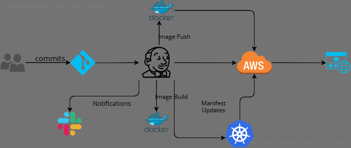

## Architecture

## Prerequisites
- A [AWS](https://aws.amazon.com/) account with a [IAM USER](https://aws.amazon.com/iam/)
- A [GitHub account](https://github.com/) 
- The [Terraform CLI](https://releases.hashicorp.com/terraform) installed locally and working
- A [Slack account](https://slack.com/) and inetgrated with [Jenkins]
- A [Jenkins] Server is ready and runing.